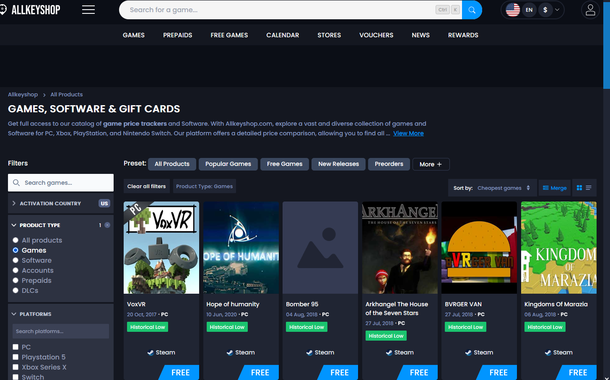

# AllKeyShop Best Deals Fix

A small browser compatibility shim that restores AllKeyShop's broken **Best deals** catalogue sort by correcting an API contract mismatch at runtime.


## What this project demonstrates

This project started as a production debugging exercise: one sort option consistently returned an empty catalogue while the same filters worked under other sort modes. Network inspection isolated the failure to a single request parameter.

The resulting fix is deliberately narrow. Rather than scraping the page, replacing the catalogue UI, or proxying traffic through another service, the userscript patches only the affected `fetch` request and leaves the rest of AllKeyShop's application behavior intact.

### Root cause

The catalogue frontend sends:

```text
sort_field=deal_score&sort_order=desc
```

The current catalogue API rejects `deal_score` as an unsupported `sort_field` and returns HTTP 400. Its validation response lists `list_score` as a supported field.

The userscript rewrites only that broken request to:

```text
sort_field=list_score&sort_order=desc
```

All filters, pagination, locale, currency, and request metadata continue to pass through unchanged.

## Engineering approach

- **Minimal blast radius:** only the AllKeyShop `CatalogV2` endpoint is eligible for rewriting.
- **Fail-open behavior:** if the shim encounters an unexpected browser/API change, the original request is sent untouched.
- **Request semantics preserved:** both string/URL inputs and `Request` objects are supported.
- **Idempotent installation:** the patch marks its wrapped `fetch` function to avoid stacking multiple interceptors.
- **Pure transformation logic:** URL matching and rewriting live in a testable function independent of the browser runtime.
- **Zero runtime dependencies:** the installed userscript is a single generated file.
- **Automated tests and CI:** Node's built-in test runner verifies rewrite scope and parameter preservation.

## Architecture

```text
AllKeyShop catalogue UI
        │
        │ fetch(...sort_field=deal_score...)
        ▼
┌───────────────────────────────┐
│ userscript request interceptor│
│                               │
│ exact endpoint/action match?  │── no ──► original fetch
│ sort_field == deal_score?     │
└───────────────┬───────────────┘
                │ yes
                ▼
       deal_score → list_score
                │
                ▼
          original fetch
                │
                ▼
       AllKeyShop CatalogV2 API
```

## Installation

1. Install Tampermonkey or Violentmonkey.
2. Open `allkeyshop-best-deals-fix.user.js` from this repository.
3. Copy it into a new userscript and save.
4. Hard-refresh AllKeyShop.
5. Open the product catalogue and choose **Sort by → Best deals**.

The userscript runs at `document-start` so it can install the compatibility layer before the catalogue application makes its first request.

## Development

Requirements: Node.js 20 or newer.

```bash
npm run build
npm test
```

`npm run build` generates the installable root-level userscript from the source template and pure rewrite function.

Project layout:

```text
.
├── allkeyshop-best-deals-fix.user.js   # generated installable userscript
├── src/
│   ├── rewrite-catalogue-url.mjs       # pure request transformation
│   └── userscript.template.js          # browser integration layer
├── scripts/
│   └── build.mjs                       # dependency-free build step
├── test/
│   └── rewrite-catalogue-url.test.mjs  # regression tests
├── docs/
│   ├── technical-notes.md
│   └── assets/
└── .github/workflows/ci.yml
```

## Verification

The regression can be observed by comparing the two catalogue states below:

| Sort mode | Result |
| --- | --- |
| Cheapest games | Catalogue responds normally |
| Best deals | Frontend emits `sort_field=deal_score`; API rejects the request |



The test suite also covers out-of-scope hosts, actions, supported sort fields, relative URLs, and parameter preservation.

## Current limitation

`list_score` is the closest currently supported server-side replacement exposed by the API, but this project does **not** claim that it is semantically identical to AllKeyShop's historical `deal_score` ordering.

The API still returns offer-level `deal_score` values. If `list_score` proves to rank products differently, the next implementation step is a client-side fallback that filters catalogue data through the supported API and performs the final deal-score ordering locally.

See [Technical notes](docs/technical-notes.md) for the debugging evidence and design trade-offs.

## Scope and privacy

The script:

- runs only on `www.allkeyshop.com`;
- does not transmit data to third-party services;
- does not read or store cookies, credentials, or account data;
- modifies only matching catalogue requests in the current page context.

This is an independent compatibility project and is not affiliated with or endorsed by AllKeyShop.

## License

MIT
