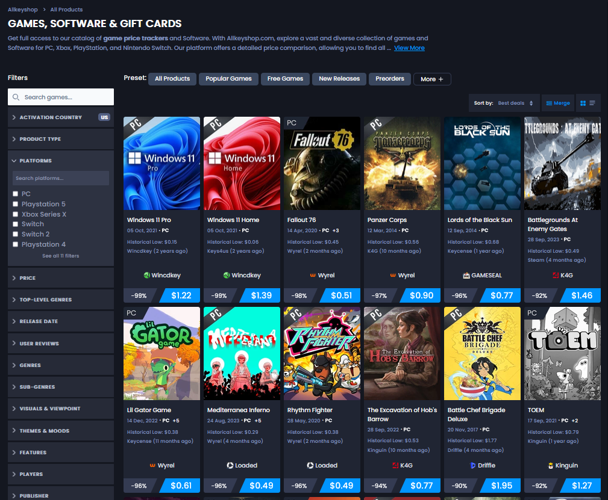

# AllKeyShop Best Deals Fix

A userscript that restores the broken **Best Deals** sort on AllKeyShop's product catalogue.

[](https://greasyfork.org/en/scripts/593252-allkeyshop-best-deals-fix)
[](https://www.buymeacoffee.com/)

> **Note:** The Greasy Fork badge currently opens search results until the final script URL is available. The support badge is a temporary placeholder.



## Problem

AllKeyShop's catalogue frontend still requests:

```text
sort_field=deal_score&sort_order=desc
```

The current `CatalogV2` API rejects `deal_score` as a sort field, so the page falls into an empty-results state. Other sorts, including `price`, continue to work.

The API still returns the data needed to build a useful deal ranking:

```text
offers.price
offers.stock_status
offers.official_offer_reduction_percent
```

This userscript intercepts only the broken Best Deals request, gathers a bounded set of catalogue candidates through supported sort modes, ranks those candidates locally, and returns a `CatalogV2` response to the existing page application.

## Ranking

For each in-stock discounted offer:

```text
referencePrice = currentPrice / (1 - discountRatio)
score = discountRatio^2 * log2(referencePrice + 1)
```

The discount is the main ranking signal. Reference price breaks ties in favor of larger discounts on higher-priced titles without letting price overwhelm the percentage reduction.

Examples:

| Current price | Discount | Inferred reference price | Relative result |
| ---: | ---: | ---: | --- |
| $8.90 | 90% | $89.00 | Very high |
| $0.50 | 90% | $5.00 | High |
| $28.00 | 60% | $70.00 | Lower |

## Candidate sampling

A full catalogue crawl would require thousands of requests. The script uses a bounded sample instead:

- geometrically spaced pages from `price asc`
- leading pages from `popularity_score desc`
- leading pages from `rating desc`
- leading pages from `release_date desc`
- several `random` pages

All active catalogue filters are preserved, including product type, platform, activation country, locale, and currency.

## Install

### Greasy Fork

Use the **Install on Greasy Fork** badge above once the listing is live.

### Manual install

1. Install Tampermonkey or Violentmonkey.
2. Create a new userscript.
3. Paste the contents of [`allkeyshop-best-deals-fix.user.js`](allkeyshop-best-deals-fix.user.js).
4. Save the script and reload AllKeyShop.
5. Open the product catalogue and select **Sort by -> Best deals**.

The userscript runs at `document-start` so it can patch `fetch` before the catalogue application loads its results.

## Implementation

```text
Best Deals request
        |
        v
fetch interceptor
        |
        v
supported catalogue queries
        |
        v
candidate de-duplication
        |
        v
local deal scoring
        |
        v
synthetic CatalogV2 response
        |
        v
AllKeyShop catalogue UI
```

The implementation is split into two parts:

- `src/catalogue-ranking.mjs`: request matching, candidate URL construction, scoring, sampling, de-duplication, and ranking
- `src/userscript.template.js`: network interception, bounded fetching, caching, and response construction

The root userscript is generated from those source files.

## Development

Requires Node.js 20 or newer.

```bash
npm run check
```

`npm run check` rebuilds the userscript and runs the Node test suite.

Repository layout:

```text
.
├── allkeyshop-best-deals-fix.user.js
├── src/
│   ├── catalogue-ranking.mjs
│   └── userscript.template.js
├── test/
│   └── catalogue-ranking.test.mjs
├── scripts/
│   └── build.mjs
├── docs/
│   ├── technical-notes.md
│   └── assets/
└── .github/workflows/ci.yml
```

## Design constraints

- Only the broken `CatalogV2` Best Deals request is intercepted.
- Existing catalogue filters are retained.
- Runtime code has no third-party dependencies.
- Candidate requests use bounded concurrency.
- Rankings are cached for five minutes per filter state.
- Failed reconstruction is surfaced as an error instead of being replaced with another sort mode.

## Limitations

The original server-side ranking is no longer available through the current API. This project reconstructs a ranking from fields still returned by the site.

Candidate collection is sampled rather than exhaustive. A deal outside the sampled pages can be missed. The result quality depends on the accuracy of `official_offer_reduction_percent` and the current offer price returned by AllKeyShop.

## Debugging notes

The request failure, rejected API fields, attempted compatibility paths, and sampling rationale are documented in [`docs/technical-notes.md`](docs/technical-notes.md).

## Privacy

The script runs only on `www.allkeyshop.com`. It does not send data to third-party services or read account credentials, cookies, or checkout data.

This project is independent and is not affiliated with AllKeyShop.

## Support

If the script saves you time or helps you find a good deal, you can support future maintenance through the badge at the top of the README.

## License

MIT
