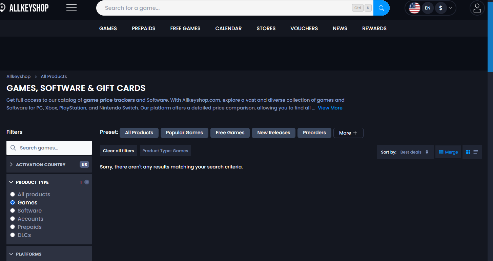

# AllKeyShop Best Deals Fix

A browser userscript that reconstructs AllKeyShop's broken **Best Deals** catalogue view from the live price and official-discount data that the site still returns.



## What this project demonstrates

This project began as a production-debugging exercise. The catalogue worked under normal sort modes, but **Best Deals** consistently returned an empty state. Network inspection isolated the failure to an API-contract regression: the frontend still requests `sort_field=deal_score`, while the current `CatalogV2` endpoint no longer accepts that field for server-side sorting.

Two server-side compatibility paths were tested and rejected:

- `deal_score` itself returns HTTP 400 as an unsupported sort field;
- the API-advertised `list_score` returns HTTP 404 for this catalogue request;
- offer-level `deal_score` values are still present but do not produce a useful historical Best Deals ordering in live results.

Version 0.5 therefore reconstructs the ranking client-side from `offers.price` and `offers.official_offer_reduction_percent`.

## Ranking model

The intended behavior is **discount-first, MSRP-weighted**: a 90% discount should dominate, while 90% off an $89 title should outrank 90% off a $5 title.

For each in-stock offer, the script infers its reference price:

```text
referencePrice = currentPrice / (1 - discountRatio)
```

and computes:

```text
score = discountRatio² × log2(referencePrice + 1)
```

Squaring the discount ratio makes percentage reduction the primary signal. The logarithmic reference-price term gives premium titles additional weight without allowing a very expensive low-discount listing to dominate the ranking.

## Candidate acquisition

The API no longer exposes a working server-side Best Deals sort, so the script builds a bounded candidate set from supported catalogue orders and ranks that set locally.

It samples:

- `price asc` across the full active price distribution using geometric page spacing;
- the first pages of `popularity_score desc`;
- the first pages of `rating desc`;
- the first pages of `release_date desc`;
- several `random` pages.

This avoids the previous failure mode where using only `price asc` made the output look like **Cheapest Games**.

## Architecture

```text
AllKeyShop catalogue UI
        │
        │ fetch(...sort_field=deal_score...)
        ▼
┌──────────────────────────────┐
│ Best Deals interceptor       │
└──────────────┬───────────────┘
               │
               ▼
  supported catalogue sampling
 price / popularity / rating /
     release date / random
               │
               ▼
 offer price + official discount
               │
               ▼
 infer reference price
               │
               ▼
 discount-first local ranking
               │
               ▼
 synthetic CatalogV2 response
               │
               ▼
     native AllKeyShop UI
```

## Engineering characteristics

- **Narrow interception:** only the broken AllKeyShop `CatalogV2` request with `sort_field=deal_score` is handled.
- **Filter preservation:** locale, currency, platform, activation country, product type, and other active filters remain in candidate requests.
- **No dead deal-score filters:** `deal_score_min/max` are removed from reconstructed requests.
- **Distribution-aware sampling:** the price catalogue is sampled densely at the cheap end and progressively across the full result set.
- **Multi-strategy candidates:** popularity, rating, release date, and random samples reduce price-order bias.
- **Bounded concurrency:** catalogue requests are intentionally limited and batched.
- **Five-minute cache:** paging through reconstructed results does not rebuild the candidate set on every click.
- **No deceptive fallback:** a reconstruction failure remains visible instead of silently returning Cheapest Games.
- **Zero runtime dependencies:** the installable userscript is a single generated file.
- **Tested pure logic:** request matching, candidate construction, scoring, sampling, de-duplication, and ordering are covered by Node tests.

## Installation

1. Install Tampermonkey or Violentmonkey.
2. Copy `allkeyshop-best-deals-fix.user.js` into a new userscript.
3. Save it and hard-refresh AllKeyShop.
4. Open the product catalogue.
5. Select **Product type → Games**, then **Sort by → Best Deals**.

The script runs at `document-start` so the interceptor is installed before the catalogue application makes its request.

## Verification

Open DevTools before selecting **Best Deals**. Version 0.5 logs the sampling pass and prints the top reconstructed deals:

```text
[AKS Best Deals Fix] intercepted broken Best Deals request
[AKS Best Deals Fix] sampling ... catalogue pages across ... active pages
[AKS Best Deals Fix] returning reconstructed page 1 (...)
```

A `console.table` shows each top candidate's discount, current price, inferred reference price, and local score.

## Development

Requires Node.js 20 or newer.

```bash
npm run check
```

This builds the root-level installable userscript and runs the test suite.

```text
.
├── allkeyshop-best-deals-fix.user.js
├── src/
│   ├── catalogue-ranking.mjs
│   └── userscript.template.js
├── scripts/
│   └── build.mjs
├── test/
│   └── catalogue-ranking.test.mjs
├── docs/
│   ├── technical-notes.md
│   └── assets/
└── .github/workflows/ci.yml
```

## Limitations

This is a reconstruction, not access to AllKeyShop's retired server-side ranking implementation. The candidate pool is deliberately bounded rather than crawling the entire catalogue, so an obscure product outside the sampled pages can be missed.

The score depends on `offers.official_offer_reduction_percent` representing the reduction from the site's reference/official offer. If that field's semantics change, the ranking model will need to be adjusted.

## Scope and privacy

The script:

- runs only on `www.allkeyshop.com`;
- does not transmit data to third-party services;
- does not read or store cookies, credentials, or account data;
- does not alter merchant redirects, checkout behavior, regional restrictions, or prices.

This is an independent compatibility project and is not affiliated with or endorsed by AllKeyShop.

## License

MIT
